# HHA504 Networking Assignment

## Azure
### Network Creation
1. Created VNet name
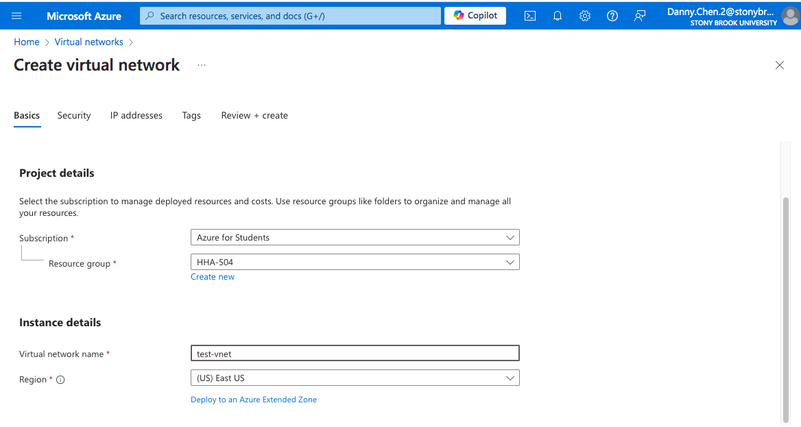
2. Created VNet subnet
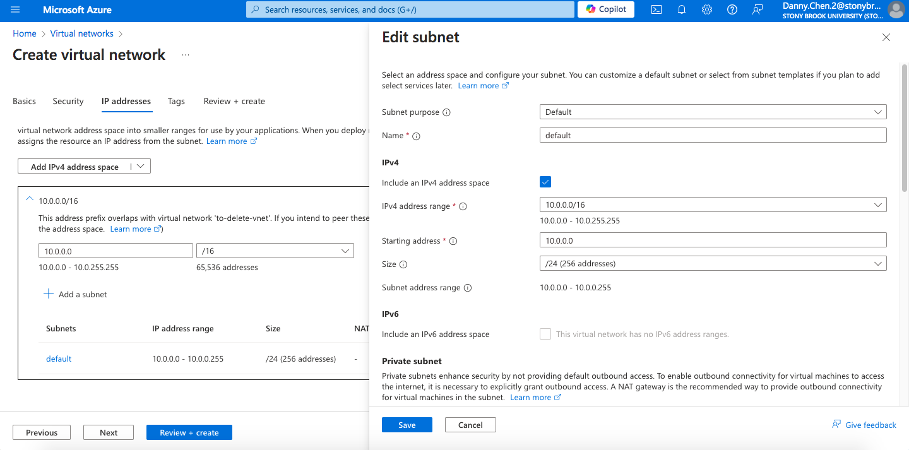
3. VNet was successfully created
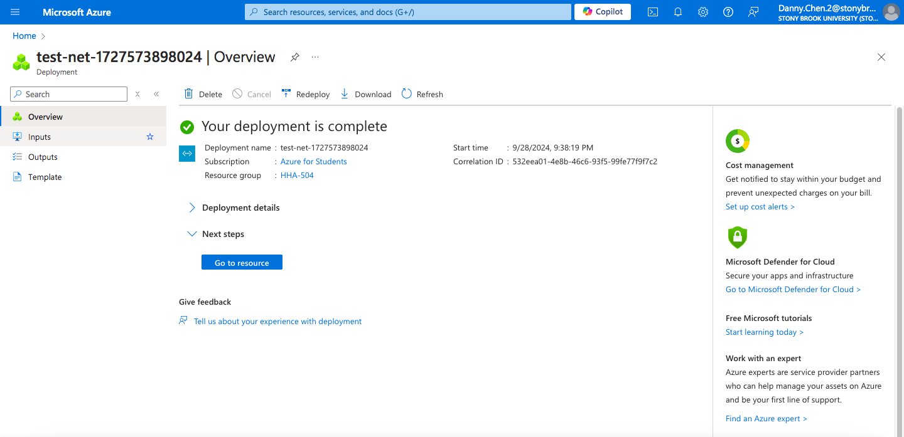

### IP Reservation
1. Created a static public IP address
    * Basics tab
        * IP Version: IPv4
        * SKU: Standard
        * Availability Zone: Zone-redundant
        * Tier: Regional
        * IP address assignment: Static
        * Routing preference: Microsoft network
    * Left everything else as default and created the IP address
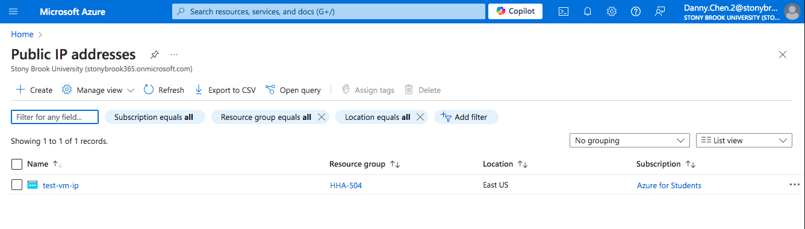
2. Created VM
    * Basics tab
        * Security Type: Standard
        * Image: Ubuntu
        * VM architecture: Arm64
        * Size: Standard_B2pts_v2 - 2 vcpus, 1 GiB memory ($6.13/month)
        * Authentication type: Password
        * Select inbound ports: HTTP (80), HTTPS (443), SSH (22)
    * Disks
        * OS disk size: Standard
    * Networking:
        * Virtual network, Subnet, Public IP --> set these three to the VNet, subnet, and IP made before

### Configure Firewall Settings
1. Clicked the VM instance 
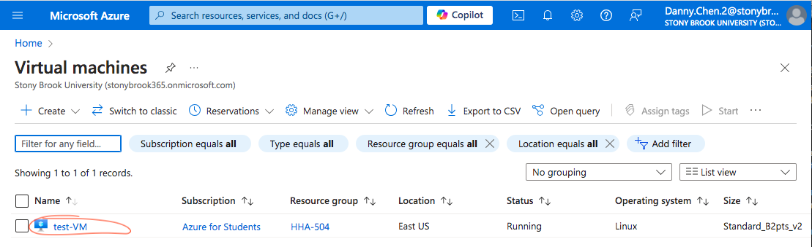 
2. Clicked "Networking settings," 
3. Clicked "Create port rule," then "Inbound port rule"
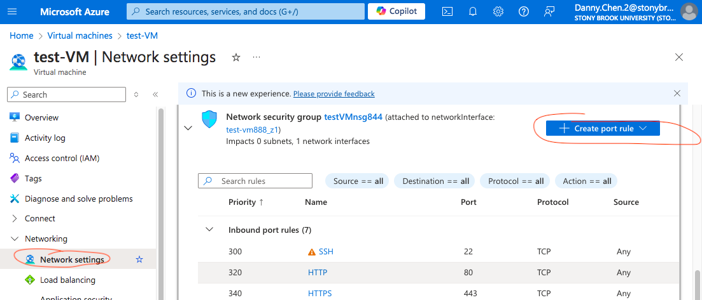 
4. Changed "Destination port ranges" to the port that will be used (5007 in my case)
5. "Protocol" can be either "Any" or "TCP"
6. Clicked "Add"
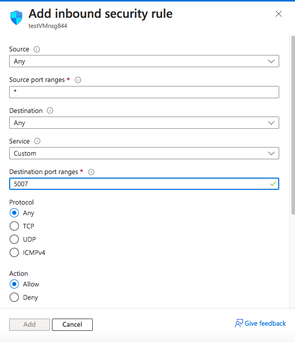 
7. Check to make sure the port was added successfully
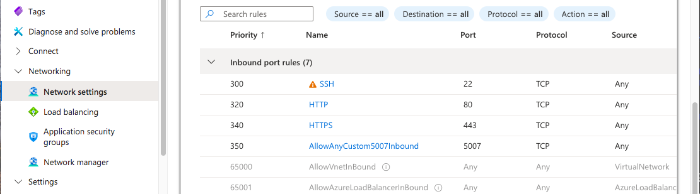 

### Steps and Screenshots to Map IP Address to Domain
1. Created a record in Namecheap and...
    * added a host name
    * pasted in the public IP from the Azure VM instance
    * set the TTL to lowest as possible (1 min in my case)
    * saved all changes
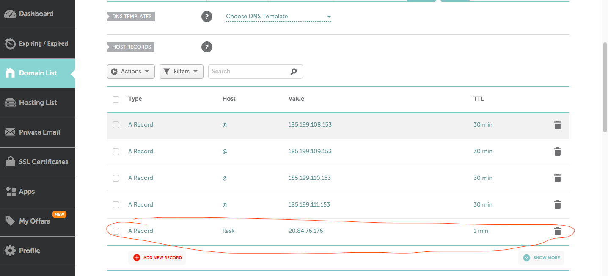
2. Opened up terminal in own desktop and ran the follow commands (cmds):
    * ssh azureuser@20.84.76.176
        * Format: ssh (VM username)@(VM IP address)
    * sudo apt-get update (NOTE: always run first when opening SSH to avoid potential errors later on)
    * python3
        * Purpose is to see if it exist
    * exit()
        * Exits python terminal
    * pip3
        * Checks if it exist. It did not, so the next cmd was ran.
    * sudo apt install python3-pip
    * git clone https://github.com/hantswilliams/hha-504-flask-networking.git
        * This repo contains the HTML that will appear after mapping is completed
    * cd hha-504-flask-networking
    * sudo apt install python3.12-venv
        * Is needed to create a venv; Azure needs a venv to install packages
    * python3 -m venv danny
        * Format: python3 -m venv (desired name for this venv)
    * source danny/bin/activate
        * This activates venv
    * pip3 install -r requirements.txt
    * python3 app.py
3. Typed 20.84.76.176:5007 into one tab and http://flask.dche.me:5007 in another. Both successfully displayed.
    * KEY NOTE: adding http:// prior to subdomain name is required or else the site will not connect
    * 20.84.76.176:5007 follows format of (ip address of VM):(port number)
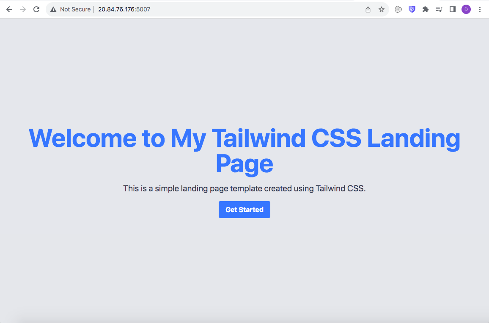
     * flask.dche.me:5007 follows (host name).(domain name):(port number)
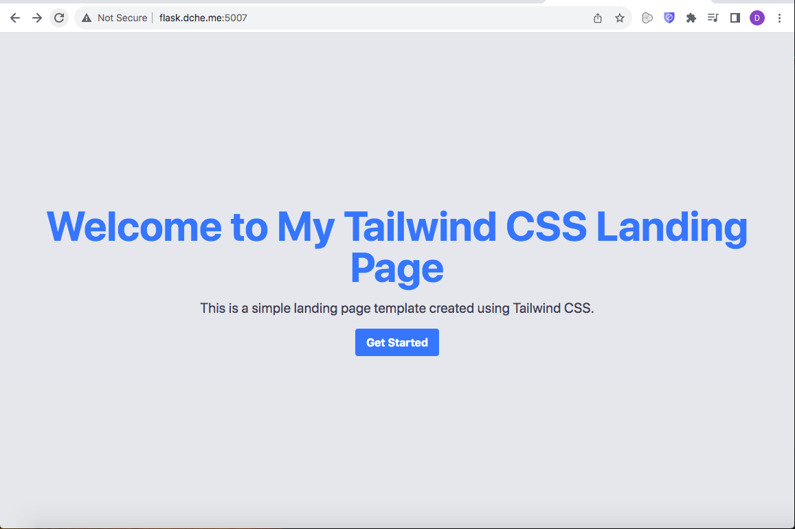

## GCP
### Network Creation
1. Created VPC network name
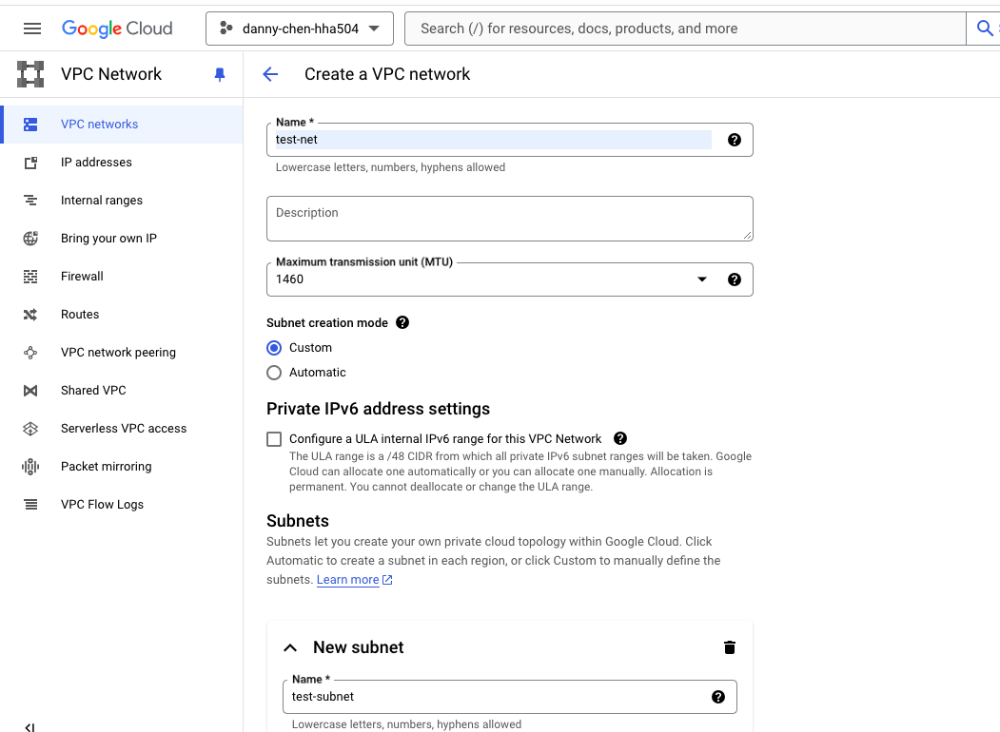
2. Created VPC network subnet
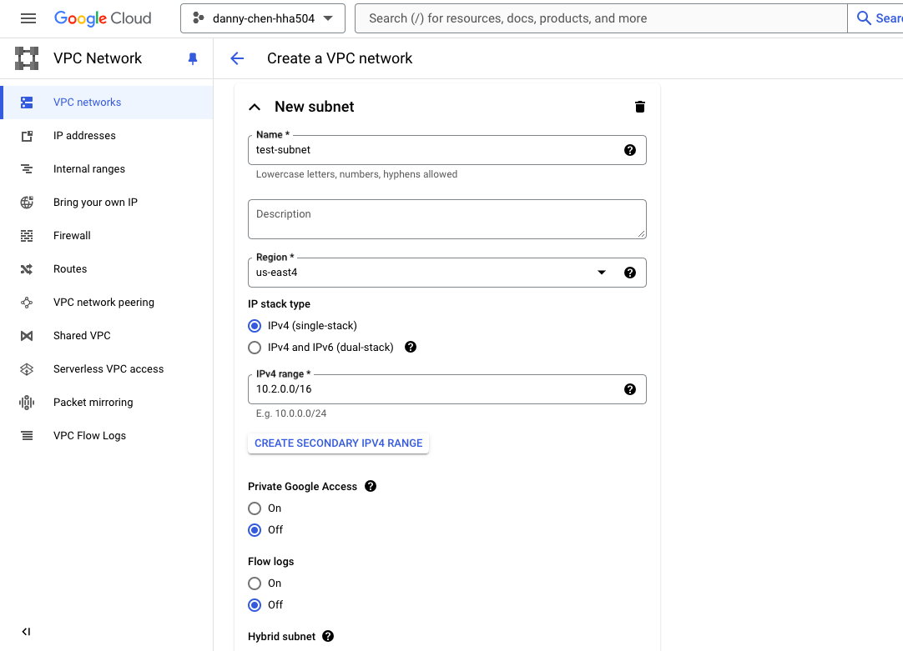
3. VPC network was successfully created
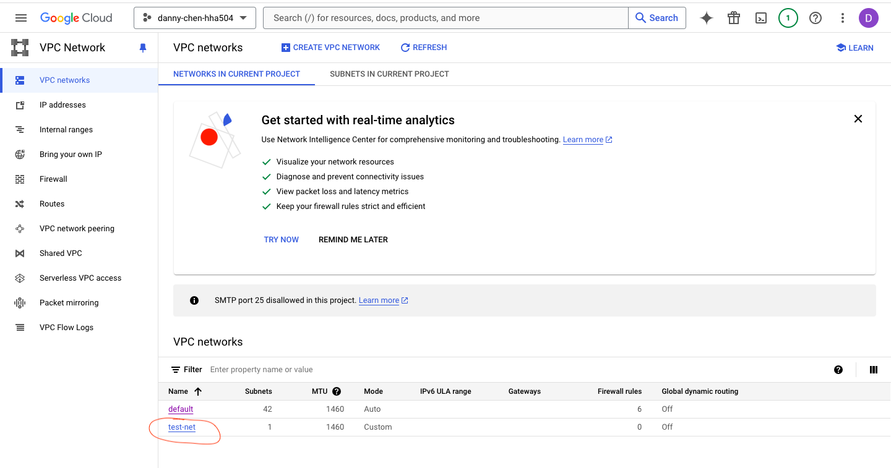

### Use of Dynamic IP
1. While creating VM, changed operating system to Ubuntu
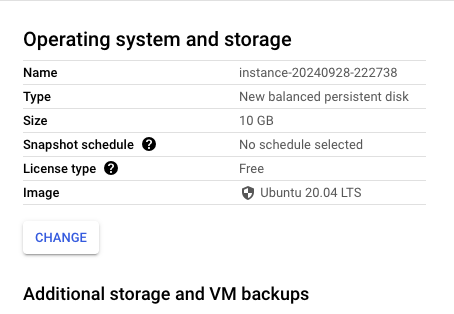
3. Turned on HTTP and HTTPS traffic
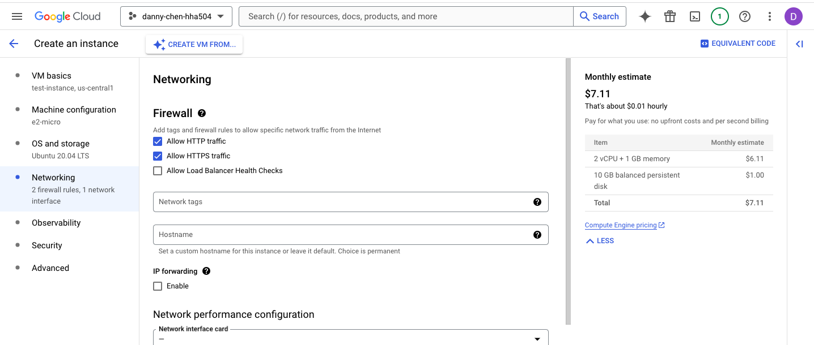
4. VM was successfully made
5. For GCP, the dynamic public IP of this VM was used
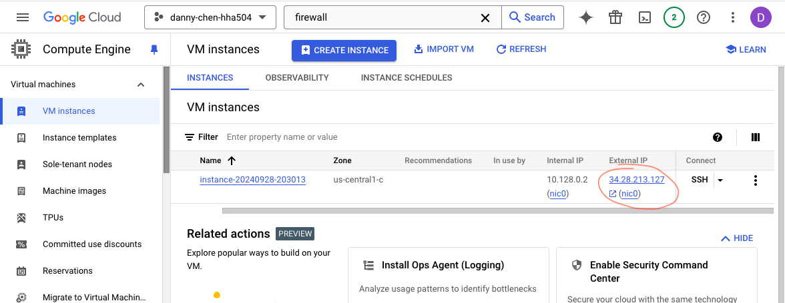

### Configure Firewall Settings
1. Typed "firewall" in GCP search bar and clicked "Firewall VPC Network"
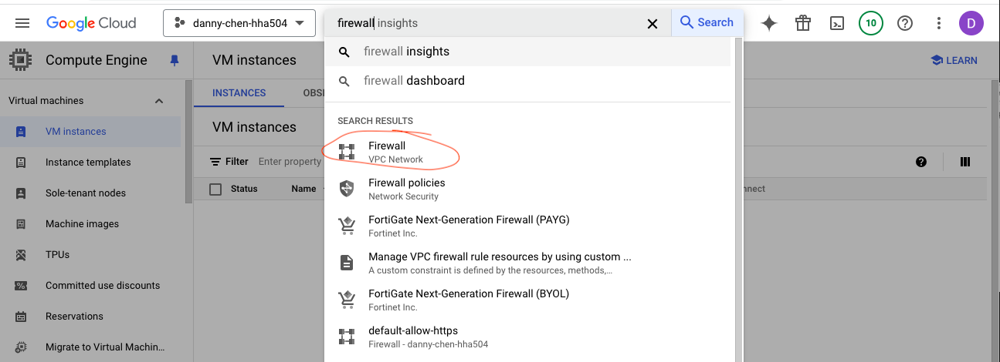
2. Clicked "Create Firewall Rule" and configured it with the following:
    * Targets: All instances in the network 
    * Source IPv4 ranges: 0.0.0.0/0
    * Checked the "TCP" box and entered the port number that the Professor's Flask app from his hha-504-flask-networking repo is using, or 5007
        * This repo will be cloned later on
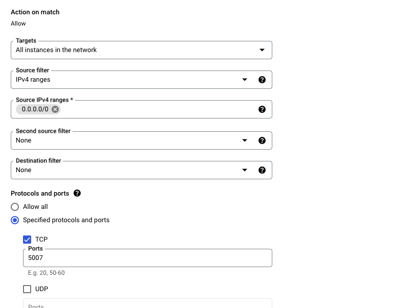
3. Clicked "Create" and the rule was successfully made
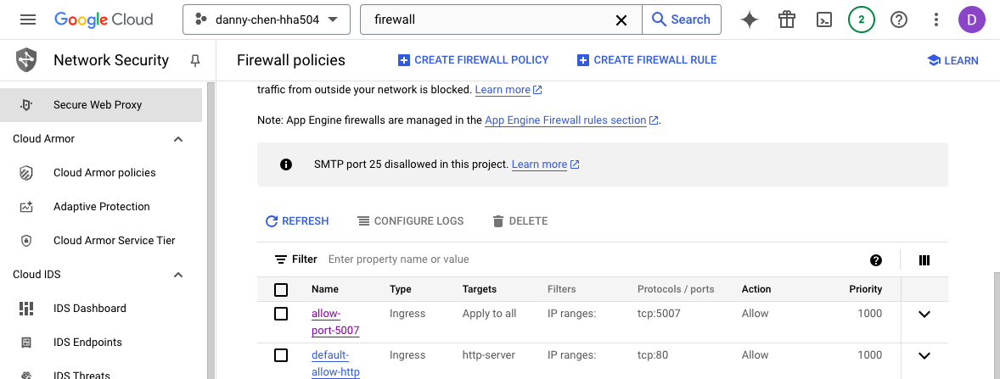

### Steps and Screenshots to Map IP Address to Domain
1. Created a record in Namecheap just like before with Azure
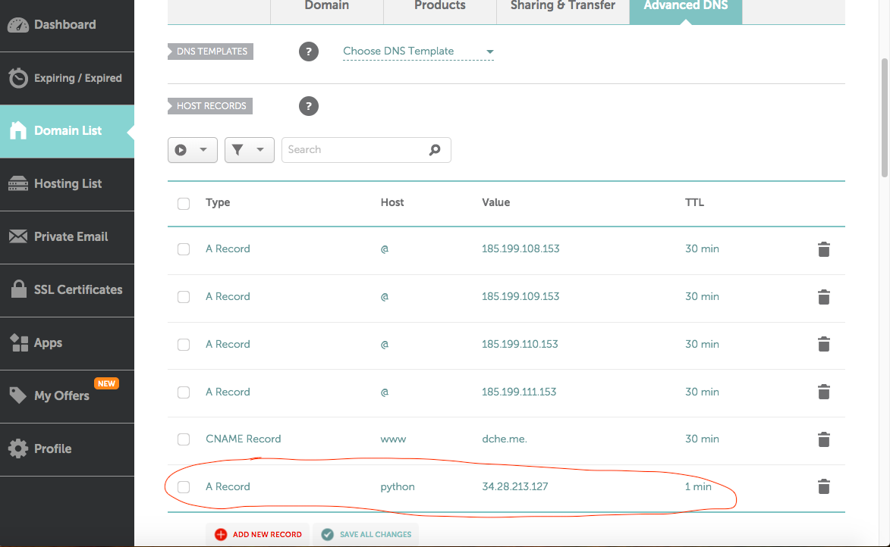
2. Clicked "SSH" of the VM instance to open up a shell
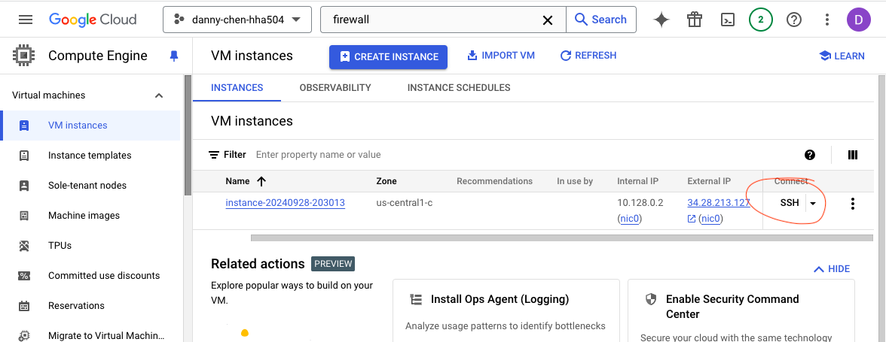
3. In the shell, the following cmds were ran in the order below:
    * sudo apt-get update
    * sudo apt install python3-pip
    * git clone https://github.com/hantswilliams/hha-504-flask-networking.git
    * cd hha-504-flask-networking
    * pip3 install -r requirements.txt
    * sudo ufw allow 5007
    * sudo ufw allow 80
    * sudo ufw allow 443
    * python3 app.py
5. Typed 34.28.213.127:5007 into one tab and python.dche.me:5007 into another. Both successfully displayed the Flask app from the cloned repo.
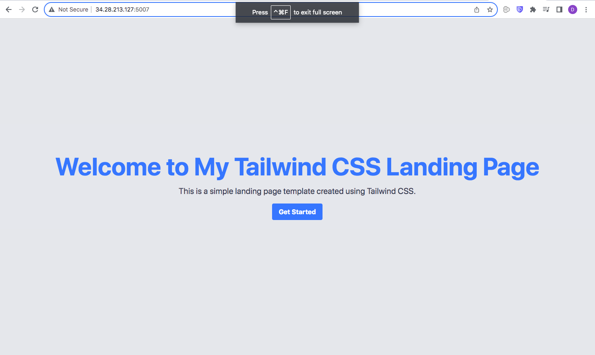
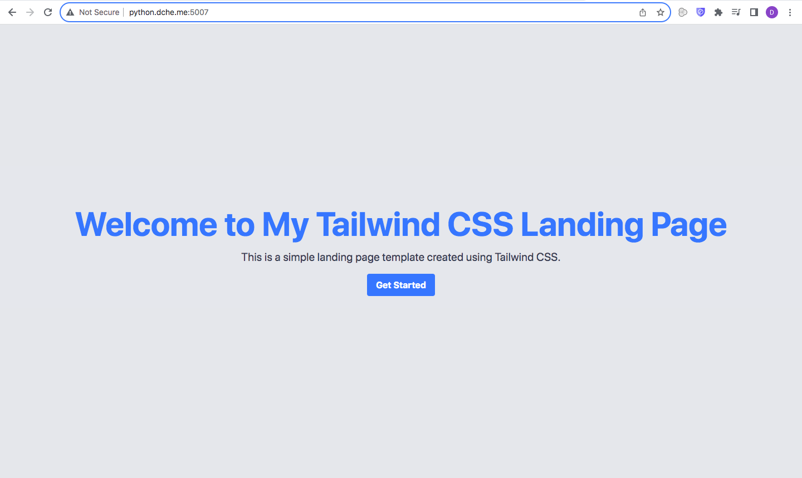
   * NOTE: The website seemed to have taken a few minutes to successfully appear. While waiting, I used a [DNS lookup site](https://www.whatsmydns.net/dns-lookup/a-records) to see if the record has propagated across the Internet.
      * I typed in "dche.me" in the website bar and viewed results globally 
