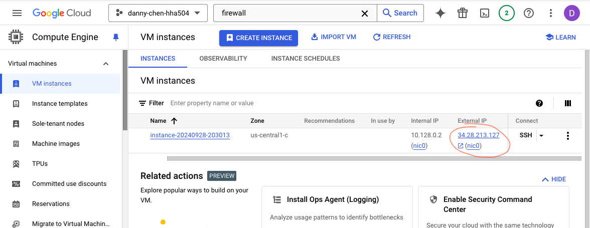
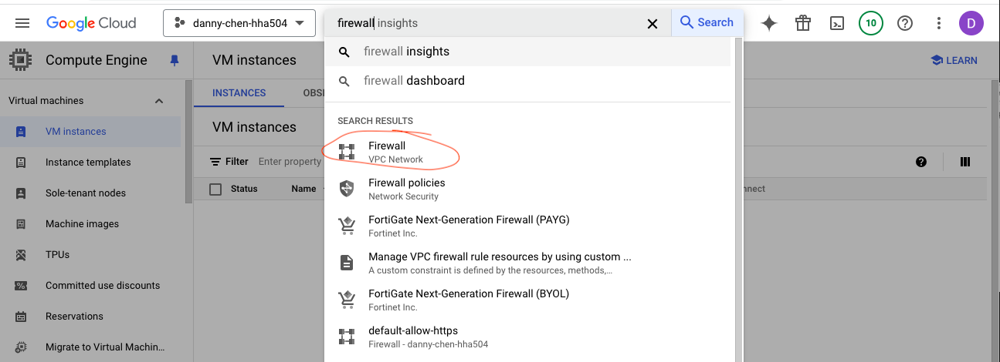
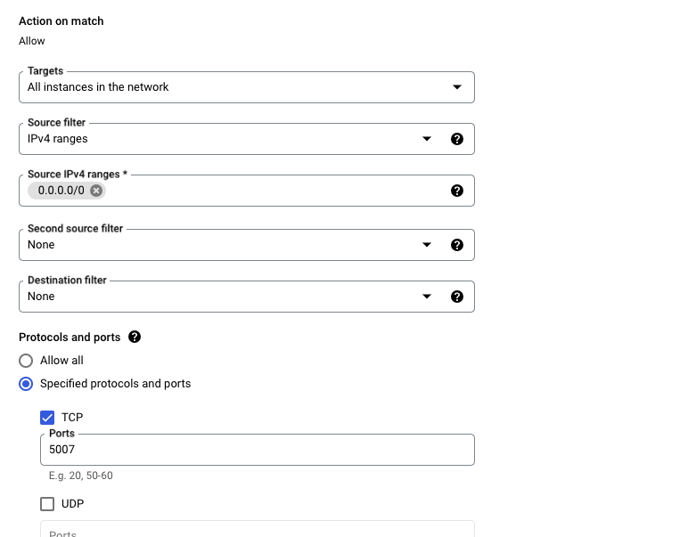
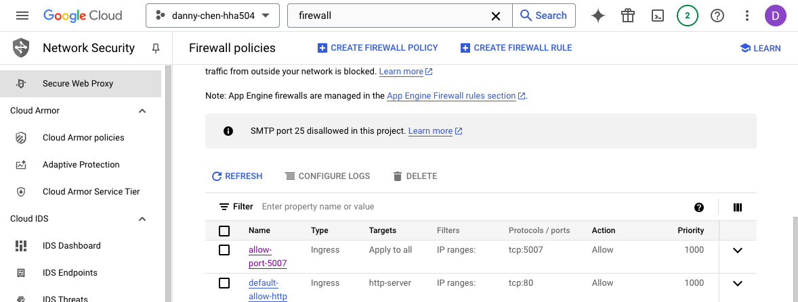
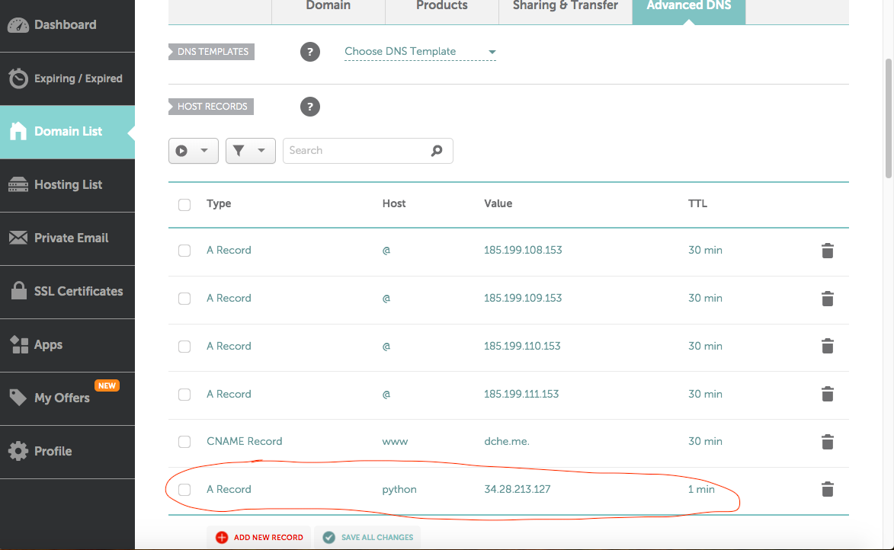
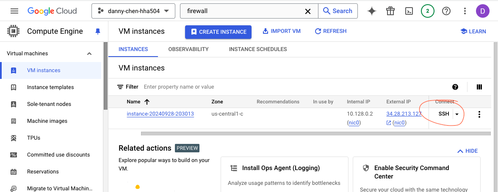
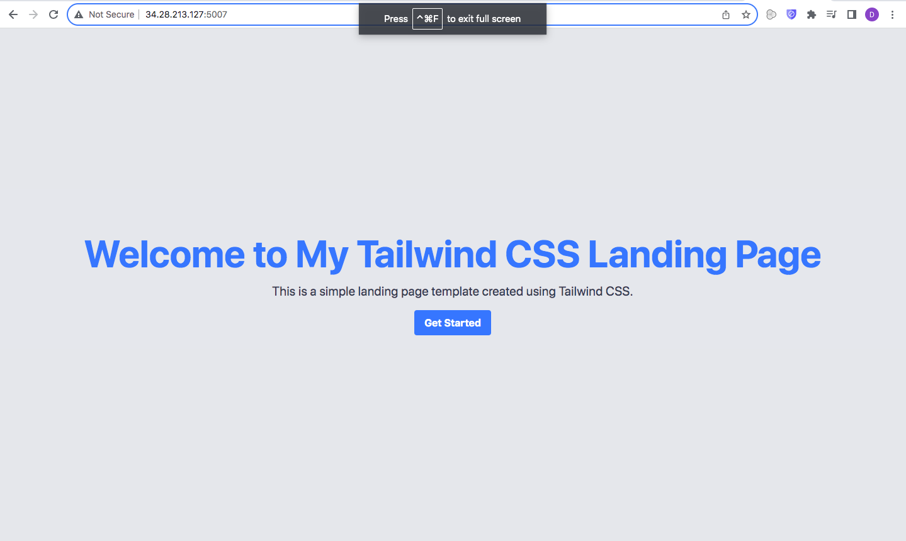
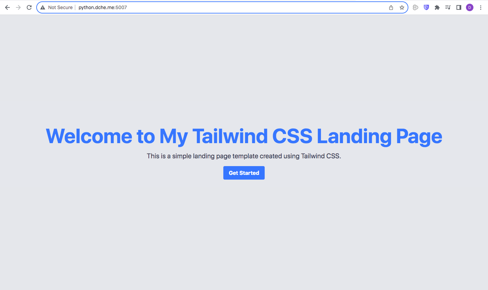

# HHA504 Networking Assignment

## GCP
### Screenshots of VPC/VNet creation and IP Reservation
#### Network Creation
1. Created VPC network name

2. Created VPC network subnet

3. VPC network was successfully created

#### Assign a Dedicated or Use Dynamic IP
1. In VM creation, changed operating system to Ubuntu

2. Turned on HTTP and HTTPS traffic

3. VM was successfully made
4. For this assignment, the dynamic public IP assigned by Azure was used

#### Configure Firewall Settings
1. Typed "firewall" in GCP search bar and clicked "Firewall VPC Network"

2. Clicked "Create Firewall Rule" and configured it with the following:
    * added a name
    * "Targets" header --> All instances in the network 
    * "Source IPv4 ranges" header --> 0.0.0.0/0
    * Checked the "TCP" box and entered the port number that the Professor's Flask app from his hha-504-flask-networking repo is using, or 5007
        * This repo will be cloned later on

3. Clicked "Create" and the rule was successfully made

#### Steps and Screenshots to Map IP Address to Domain
1. Created a record in Namecheap and...
    * added a host name
    * pasted in the public IP from the GCP VM instance
    * set the TTL to lowest as possible (1 min in this case)
    * saved all changes

2. Clicked "SSH" of the VM instance to open up a shell

3. In the shell, the following commands (cmds) were ran in the order below:
    * sudo apt-get update (NOTE: always run first when opening SSH to avoid potential errors later on)
    * git clone https://github.com/hantswilliams/hha-504-flask-networking.git
        * This repo contains the HTML that will appear after mapping is completed
    * cd hha-504-flask-networking
    * pip3 install -r requirements.txt
    * sudo ufw allow 5007
    * sudo ufw allow 80
    * sudo ufw allow 443
    * python3 app.py
5. After running the last cmd, I typed 34.28.213.127:5007 into the search bar of one tab and python.dche.me:5007 of another tab. Both successfully displayed the HTML from the cloned repo.
    * NOTES
        * The website seemed to have taken a few minutes to successfully appear. While waiting, I used a [DNS lookup site](https://www.whatsmydns.net/dns-lookup/a-records) to see if the record has propagated across the Internet.
            * I typed in "dche.me" in the website bar and viewed results globally 
        * 34.28.213.127:5007 follows format of (ip address):(port number)

        * python.dche.me:5007 follows (host name).(domain name):(port number)
