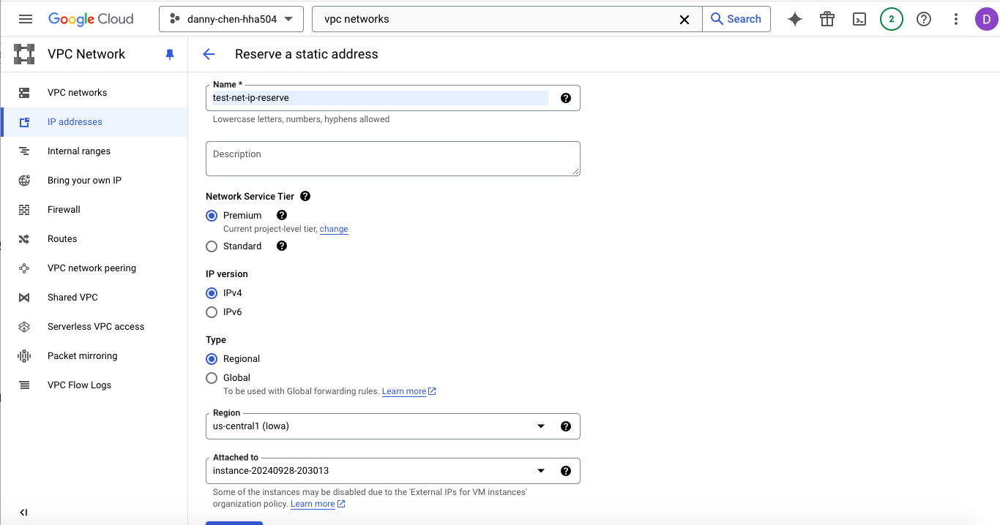
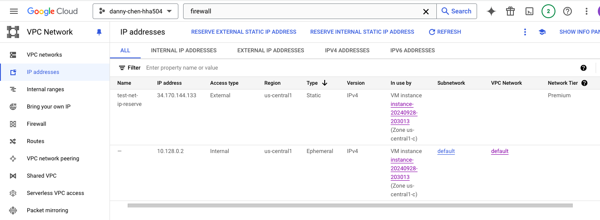

# HHA504 Networking Assignment
NOTE: Per the updated instruction on 9/16/24's lecture, Azure was left alone and only GCP was completed.

## GCP - Screenshots of VPC/VNet creation and IP Reservation
### Network Creation

### IP Reservation

## GCP - Attempts and Screenshots to Map IP Address to Domain
I was ultimately unable to map the IP address from GCP to a domain. Below are what I tried:

1. Followed along with a YouTube tutorial to try mapping a reserved IP address to a domain name
    * Video Name: [Setting Up Custom Domain With Google Cloud Compute Engine Instance](https://www.youtube.com/watch?v=eXtqqofrhOo)
2. Enabled the Cloud DNS API
3. Created a zone titled "test-net-zone" with a DNS name of my GitHub Pages site link

4. Created a record set by pasting the external IP of my VM instance (titled "test-instance) to the "IPv4 Address" box, then clicking "Create"
5. After creation of record set, I clicked "Registrar Setup" at the top right of the page
6. A message then appeared, which told me...
    * the zone will not be usable until I register the related domain and configure the records with my registrar
    * four name servers:
        * ns-cloud-a1.googledomains.com
        * ns-cloud-a2.googledomains.com
        * ns-cloud-a3.googledomains.com
        * ns-cloud-a4.googledomains.com
7. The user in the YouTube tutorial pasted each of the above items into the name server section of his own domain. GitHub Pages did not have that section, so I attempted to save each of the above name servers to its "Custom domain" section. However, trying to save each one led to one of two types of errors:
    * Custom domain name is already taken

    * DNS check unsuccessful

8. I did some further digging to see if it was truly possible to link a reserved IP address to a GitHub Pages site. Based on what I found from a few sources, it does not seem possible to link the IP address directly to the GitHub Pages site without giving the site a custom domain name first. 
9. I researched for websites that offered free domain names that students could use for a short, temporary period of time. However, I was unable to find any.
10. Obtaining a domain name seems to be mandatory to complete this part of the assignment. Alongside the tutorial I followed, other tutorials I came across also involved the users using their own domain name. Since it requires purchasing one, I was unsure what to do next from here.

